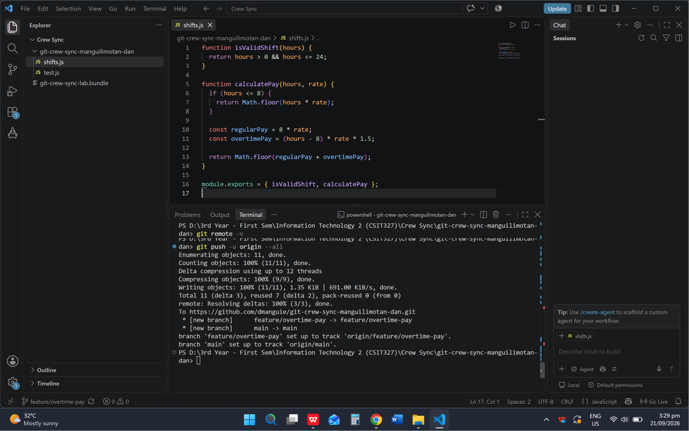
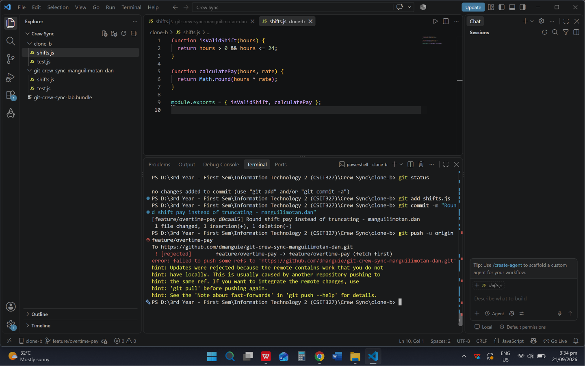
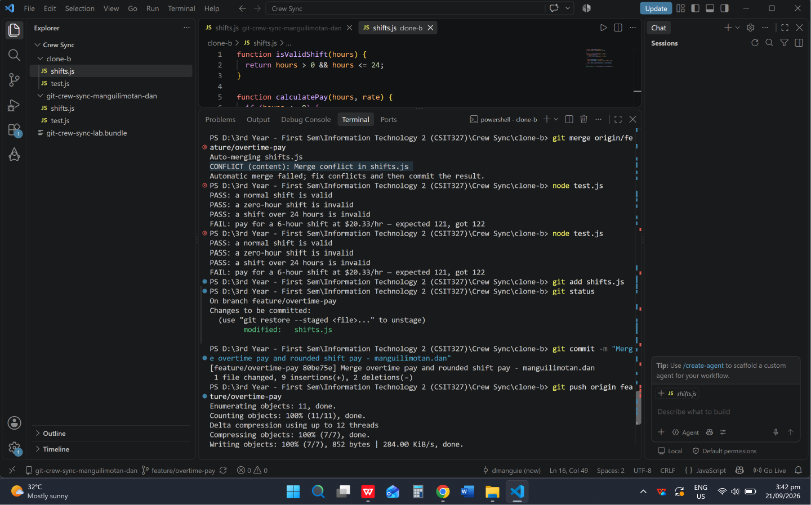
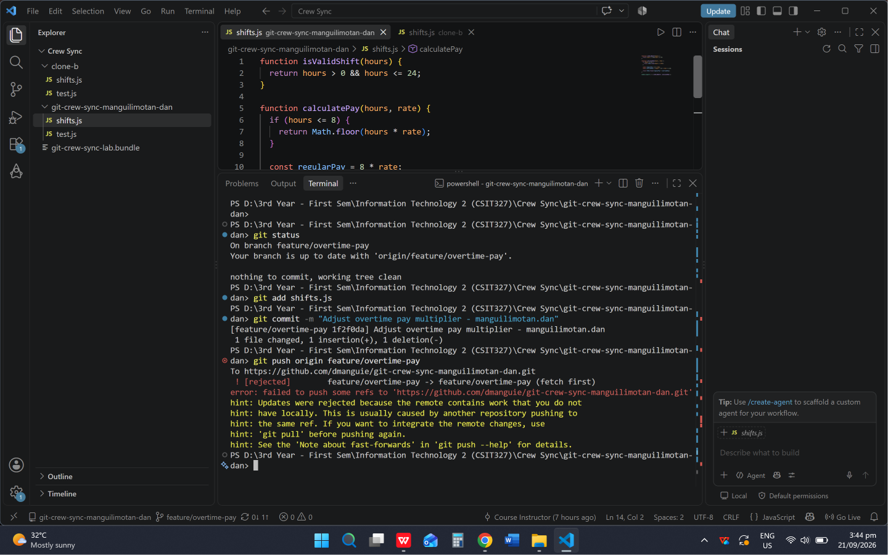
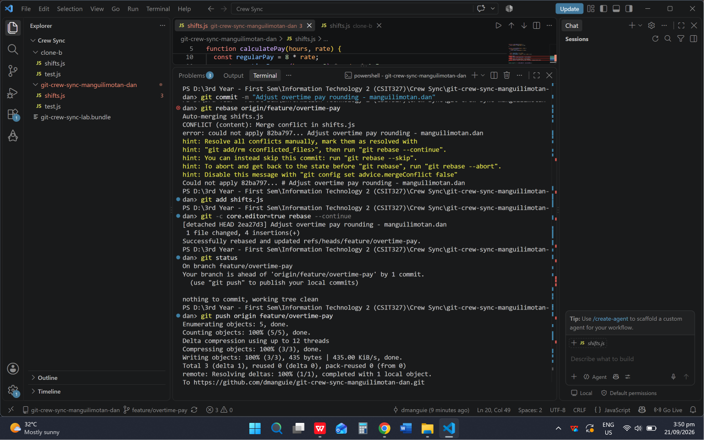
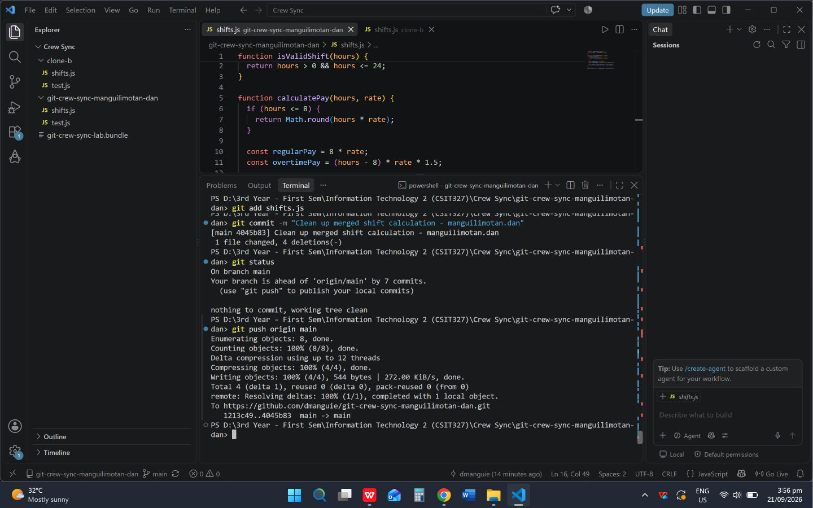
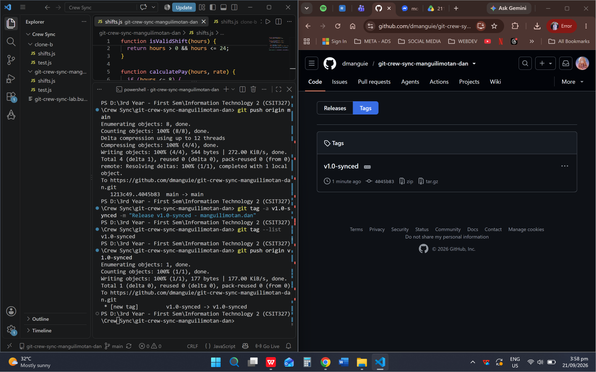

# Crew Sync Workflow

## Task 1 — Successful Push from Clone A

Added overtime pay for shifts over 8 hours and pushed the `feature/overtime-pay` branch from Clone A to the GitHub repository.

## Task 2 — Rejected Push from Clone B

Clone B changed the pay calculation from truncation to rounding. The push was rejected because the remote feature branch already contained work from Clone A that Clone B did not have locally.

## Task 3 — Merge Conflict and Resolution

In Clone B, I fetched the latest remote changes and merged them into the local feature branch. Git reported a conflict in `shifts.js` because both clones had changed the same part of the file. I resolved the conflict by preserving both behaviors: overtime pay for shifts over 8 hours and rounded pay calculation. I then committed the merge and pushed the resolved branch.

## Task 4 — Rejected Push and Rebase Conflict

In Clone A, I made another change and attempted to push it, but the push was rejected because the remote branch had newer commits. I fetched the remote changes and rebased my local commit onto the updated branch. The rebase produced a conflict in `shifts.js`, which I resolved before continuing the rebase. The rebased branch was then pushed normally without force.

## Task 5 — Merge Feature into Main

Merged `feature/overtime-pay` into `main` using a non-fast-forward merge and pushed the updated `main` branch to GitHub.

## Task 6 — Tag Final Commit

Created the `v1.0-synced` tag, pushed the tag to GitHub, and verified that the tag appeared on the repository's Tags page.

# Reflection

## 1. What did the rejected push error message tell you, and why did it happen?

The rejected push message said that the remote contained work that I did not have locally and advised me to integrate the remote changes before pushing. It happened because another clone had already pushed commits to the same branch, so my local branch was behind the remote branch.

## 2. Difference between Task 3 merge vs Task 4 rebase

Task 3 used `git merge` to combine the two histories and create a merge commit. Task 4 used `git rebase` to replay the local commit on top of the updated remote branch. Rebase creates a more linear history and changes the commit hash of the rebased commit.

## 3. What habit would have avoided both rejected pushes?

A useful habit is to synchronize with the remote branch before starting work or before pushing. Fetching the latest changes and checking the branch status can help identify whether another teammate has already pushed changes.

## 4. Which approach—merge or rebase—would you default to on a shared team branch, and why?

On a shared team branch, I would generally use merge because it preserves the existing shared history and does not rewrite commits that other teammates may already have based their work on. I would use rebase mainly for local or private feature work when maintaining a linear history is useful.